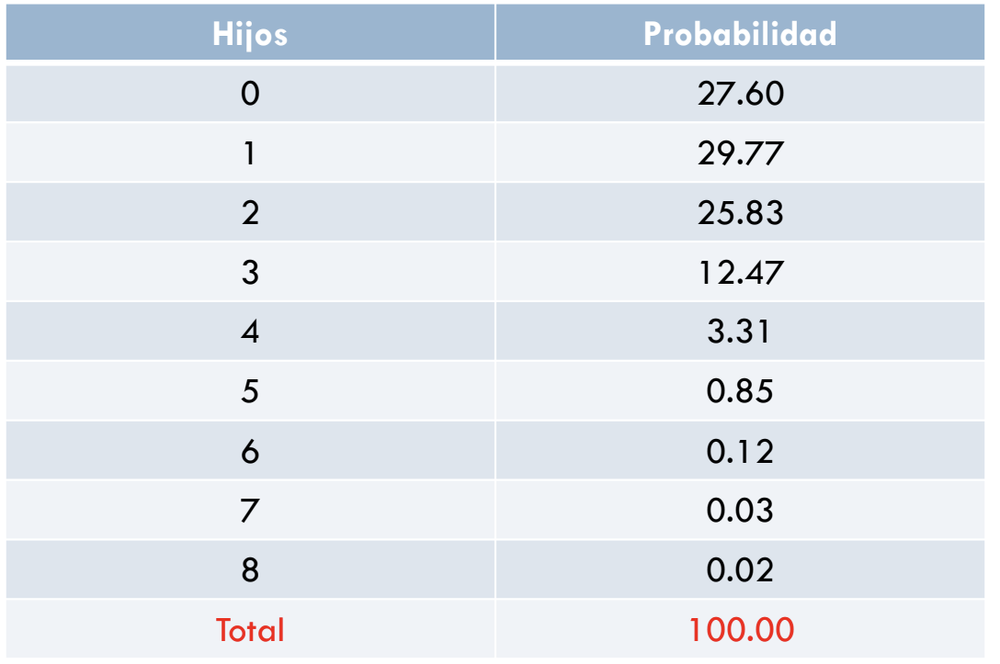
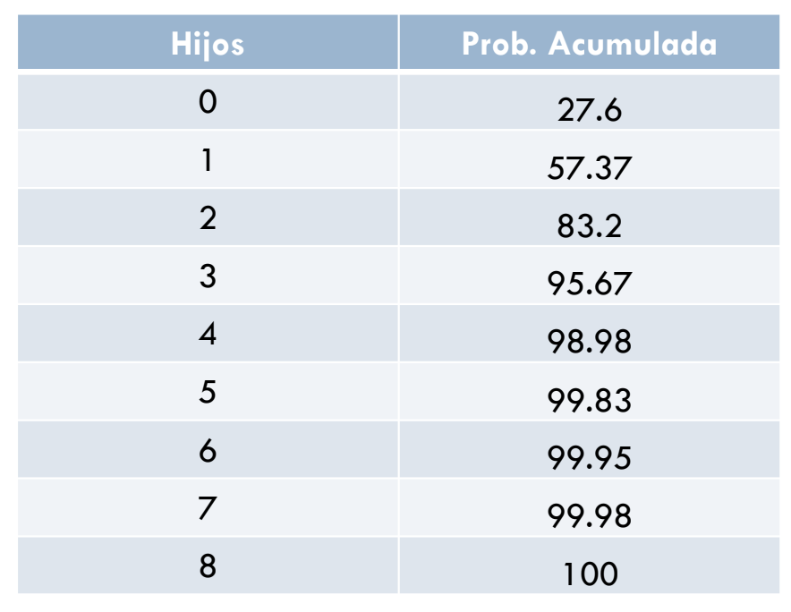

## 0. Objetivo del práctico

El objetivo de este práctico es realizar un breve repaso a ciertos conceptos clave y definiciones básicas de los **fundamentos de probabilidad**, pasando por la definición de una variable, sus distribuciones, y las formas de medirlas y/o resumirlas.

Recordar que la idea principal que se encuentra a la base de la probabilidad refiere a que cuando observamos el comportamiento del azar, este resulta impredecible con pocas repeticiones pero presenta un **comportamiento regular y predecible** con muchas repeticiones.

### Materiales de la sesión

Recuerden que los archivos asociados a este práctico los pueden encontrar en: Apéndice A1 y B - Woolridge

## 1. Variables aleatorias y sus distribuciones de probabilidad

Las Variables Aleatorias (VA) son **variables estadísticas** en la que sus valores se obtienen a partir del resultado de algún tipo de experimento. En otras palabras, son variables cuyos valores son **resultados numéricos** de un fenómeno aleatorio. Un ejemplo de experimento puede ser algo tan simple como lanzar una moneda 20 veces y anotar las veces que obtenemos cara. La cantidad de veces que efectivamente salió cara en el experimento constituye una variable aleatoria. Este experimento puede ser realizado infinitas veces, y en otro ensayo se puede obtener un resultado completamente distinto.

Las variables aleatorias se dividen en *discretas* y *continuas*. Una **variable aleatoria discreta** es una variable que solo toma una cantidad finita o una cantidad infinita contable de valores. *¿Qué significa esto?* Significa que aunque la variable pueda tener resultados infinitos, estos solo toman valores enteros positivos. Por ejemplo, si lanzamos un dado y anotamos el resultado, solo podemos tener valores del 1 al 6. En ningún caso tendremos un resultado negativo o con decimales. 

En ciertas ocasiones, estimaremos eventos que son cualitativos. Por ejemplo, nos interesa estimar la participación de los alumnos de enseñanza media en manifestaciones del estallido social. En ese caso, la variable también toma valores numéricos. Se puede definir la variable como: *X = 1* si se participa en la manifestación, *X = 0* si no se participa. En esta situación, como podrán notar, nos enfrentamos a una variable aleatoria discreta. Además, cuando una variable **solo** puede tomar los valores de 0 y 1, hablamos de una **variable binaria**.

Las variables aleatorias discretas se describen estadísticamente por su *distribución de probabilidad.* Esta corresponde a la probabilidad de la ocurrencia de cada valor de la variable. Siguiendo con el ejemplo del lanzamiento de un dado, su distribución de probabilidad consiste en todos los valores que puede tomar la variable (1 al 6) y la probabilidad de obtener cada una de ellas (en este caso, cada valor tiene una probabilidad de 1/6). La suma de la distribución de probabilidad es igual a 1.

Las variables aleatorias discretas se pueden representar en tablas o cuadros. Por ejemplo, si la variable corresponde a la cantidad de hijos: 

**Tabla 1: Distribución de Probabilidad Variable Cantidad de Hijos**

{width="529"}

**Gráfico 1: Distribución de Probabilidad Variable Cantidad de Hijos (en porcentaje)**

{width="549"}

Además de la distribución de probabilidad, también existe la **distribución de probabilidad acumulada**, la cual determina la probabilidad de que una variable sea igual o menor a un valor concreto. Siguiendo con la variable cantidad de hijos:

**Tabla 2: Distribución de Probabilidad Variable Cantidad de Hijos**

{width="529"}

***Gráfico 2: Distribución de Probabilidad Acumulada (en porcentaje)***

{width="529"}

Por su parte, las **VA continuas (VAC)** indican que X puede tomar ciertos valores con probabilidad cero, es decir, una variable $X$ es una variable aleatoria continua si la probabilidad de que la variable aleatoria tome cualquier valor real sea igual a cero. *¿Cómo es posible esto?* La idea es que los valores que puede tomar una variable aleatoria continua son tantos que es imposible contarlos. Es por esto que la probabilidad de que la variable tome cada uno de estos valores es cero.

Estas se describen por medio de su **función de densidad de probabilidad (fdp)**, la cual resume la información concerniente a los valores que puede tomar $X$ y a sus correspondientes probabilidades. La fdp de una variable continua solo se utiliza para calcular eventos que comprenden un *rango* de valores. Un ejemplo de una variable continua donde nos podría interesar su rango de valores consiste en los ingresos de un hogar.

***Gráfico 3: Función de Densidad de Probabilidad***

{width="468"}

En este gráfico podemos observar que:

$$
Pr(-2\leq X \leq 1)
$$

se encuentra representada por el área debajo de la curva. Es decir, la probabilidad de que X se encuentre entre -2 y 1 es el *área bajo la curva* entre esos puntos en el gráfico. Como resume probabilidades, toda el área bajo la curva de la fdp debe ser igual a uno.

Para todas las distribuciones continuas importantes en la probabilidad y en la estadística, las funciones de distribución acumulada ya han sido tabuladas, y la más conocida de estas es la **distribución normal**, la cual tendrá un rol fundamental a lo largo del curso.

## 2. Distribuciones conjuntas, condicionales, marginales e independencia

### 2.1 Distribución Conjunta

En muchos casos, resulta interesante estudiar de manera conjunta el comportamiento de las variables. En dichos caso, se construye lo que se denomina **distribución conjunta**. Su objetivo consiste en determinar cómo la variación de una variable se relaciona con la de otra. En el caso de que  $(X,Y)$ sean variables aleatorias discretas, entonces $(X,Y)$ tienen una distribución conjunta, descrita completamente por la **función de densidad de probabilidad conjunta** de $(X,Y)$.

En palabras más simples, la distribución conjunta corresponde a la probabilidad de que ocurran dos o más variables aleatorias, al mismo tiempo. Un ejemplo de estudio puede ser la relación entre ingreso y el gasto en vestimentas en un mes.

***Tabla 3: Distribución Conjunta del Gasto en Vestimenta***

{width="506"}

***Tabla 4: Distribución Marginal del Gasto en Vestimenta***

{width="489"}

Las casillas en color rosado nos muestra la distribución marginal del gasto en vestimenta.

### 2.2 Distribución Marginal

Las distribuciones de la variable fila y de la variable columna, de forma separada, se llaman **distribuciones marginales**, ya que aparecen en los márgenes derecho e inferior de la tabla de contingencia. La columna de totales y la fila de totales de una tabla de contingencia dan las distribuciones marginales de las dos variables de forma separada. **Las distribuciones marginales no dan información sobre la relación entre las variables.**

Cada componente de una variable aleatoria bidimensional es una variable aleatoria unidimensional en sí misma. Es por esto que nos puede interesar conocer la distribución de un componente por separado, sin tener en cuenta el otro componente. Eso se denomina marginar, y la **distribución de la variable unidimensional** por separado se llama distribución marginal.

La **distribución marginal** del gasto en vestimenta equivale a su **distribución unidimensional**:

***Tabla 5: Distribución Marginal del Gasto en Vestimenta***

{width="413"}

La **media** es de 2777.5 y la **desviación estándar** es de 1739.

### 2.3 Distribución Condicional

Para hallar la **distribución condicional** de la variable fila con relación a un valor determinado de la variable columna, fíjate sólo en esa columna de la tabla. Expresa cada valor de la columna como un porcentaje del total de la columna. Existe una distribución condicional de la variable fila para cada columna de la tabla. La comparación de estas distribuciones condicionales es una manera de mostrar la asociación entre la variable fila y la variable columna. Es especialmente útil cuando la variable columna es la variable explicativa.

Una **característica importante** de las distribuciones condicionales es que, si $$X$\$ y $$Y\$\$ son variables aleatorias independientes, conocer el valor que toma \$$X$\$ no dice nada acerca de la probabilidad de que Y tome diversos valores (y viceversa).

***Tabla 6: Distribución Condicional del Gasto en Vestimenta***

{width="456"}

La media condicional para la fila amarilla es de 1815, para la fila verde de 1949.2 y para la fila roja es de 3365.8.

### 2.4. Media condicional

Tal como ya veremos más adelante, la covarianza y correlación miden la relación lineal entre dos VA tratándolas simétricamente, pero en las ciencias sociales es frecuente que se desee explicar una variable $Y$ en términos de otra, $X$. Ya antes revisamos el concepto de una función de densidad de probabilidad condicional de $$Y$\$ dada $$X\$\$. Suponga que se quiere ver cómo cambia la distribución de los salarios con base en el nivel de educación. Sin embargo, por lo general se quiere encontrar una manera sencilla de resumir esta distribución. En este caso, un solo número no podrá ser suficiente, ya que la distribución de $$Y$\$ dado $$X=x\$\$ depende, por lo general, del valor de $$x$\$. No obstante, la relación entre $$Y\$\$ y $$X$\$ puede resumirse empleando la **esperanza (o media) condicional** de $$Y$$ dado $$X\$\$.

***Tabla 7: Media y media condicional***

{width="440"}

[Ventaja:]{.ul} aprovechar la información contenida en la variable ingreso.

### 2.5. Independencia

La independencia de variables aleatorias es un concepto muy importante. Decimos que $$X$\$ e $$Y\$\$ son independientes si conocer el valor de una de las variables no aporta información sobre la otra. En otras palabras, si la **distribución condicional** de $$Y$\$ dado $$X\$\$ es igual a la **distribución marginal** de \$$Y$\$. Por ejemplo, si lanzamos una moneda y en el primer intento da cara, luego en el segundo lanzamiento vuelve a dar cara, decimos que los sucesos "cara en el primer lanzamiento" y "cara en el segundo lanzamiento" son **independientes.** Estosignifica que el resultado del primer lanzamiento no puede influir sobre el del segundo.

Formalmente,

$$
Pr(Y=y|X=x)=Pr(Y=y)
$$

Su implicancia es:

$$
Pr(X=x,Y=y)=Pr(X=x)*Pr(Y=y)
$$

## 3. Características de las distribuciones de probabilidad

### 3.1 Medidas de Tendencia Central: Media Aritmética

El **valor esperado** es uno de los conceptos más importantes de la probabilidad al cual también se le suele llamar media poblacional, en especial cuando se quiere hacer énfasis en que $$X$\$ representa una variable poblacional. Es un **promedio ponderado** de todos los posibles valores de $$X\$\$, es decir, la suma de **todas** las **puntuaciones** de una variable \$$X$\$ **dividida por** el **número** de **observaciones.** 

### 3.2 Medidas de tendencia central: Mediana

En general, es la puntuación que se encuentra en la mitad de una distribución de puntuaciones x. Indica el valor bajo el cual se encuentra el 50% de los casos. Su cálculo sólo exige orden en las puntuaciones, se puede aplicar a variables de escalares y ordinales. Es el **valor** que se ubica en la **mitad** de la distribución de los datos.

Si $$X$\$ es continua, entonces la mediana de $$X\$\$, llámese m, es el valor tal que una mitad del área bajo la curva de la Función de Densidad de Probabilidad queda a la izquierda de $$m$\$ y la otra mitad del área queda a la derecha de $$m\$\$. Si $$X$\$ es discreta y toma una cantidad finita de valores, la mediana se obtiene ordenando todos los posibles valores de $$X\$\$ y seleccionando después el **valor** que se encuentra al **medio**.

### 3.3 Medidas de tendencia central: Moda

El **atributo** que más se repite o posee **mayor frecuencia** en una muestra.

### 3.4 Medidas de Variabilidad o Dispersión: Varianza

La **varianza** ($$σ²$$) de un conjunto de observaciones es la suma de los cuadrados de las desviaciones de las observaciones respecto a su media dividido por $$n−1$\$. Si tenemos una variable aleatoria $$X\$\$, sea $$\mu= E(X)$\$, existen varias maneras de medir qué tan lejos está $$X\$\$ de su valor esperado, pero la forma más sencilla para manipular algebraicamente es el cuadrado de la diferencia, \$$(X - \mu)^2$\$.

Así como se necesita un número que resuma la tendencia central de $$X$\$, también se requiere uno que indique qué tan lejos, *en* *promedio*, está $$X\$\$ de $$\mu$\$. Este **número** es lavarianza, que da la **distancia esperada de** $$X\$\$ **a su media**.

### 3.5 Medidas de Variabilidad o Dispersión: Desviación Estándar

La **desviación estándar** de una variable aleatoria, que se denota sd(\$\$X\$\$), es la raíz cuadrada positiva de la varianza:

$$
sd(X)  \equiv + \sqrt{Var(X)}
$$

     

La desviación estándar también se suele expresar así: \$$σ$\$.

## 4. Características de las distribuciones conjuntas y de las condicionales

### 4.1 Covarianza

En el primer apartado, introducimos el concepto de probabilidad conjunta, cuando dos VA pueden tomar simultáneamente ciertos valores concretos. La **covarianza** refleja la **relación lineal** de 2 VA, es decir, de $$X$\$ e $$Y\$\$. Es una medida de dependencia lineal entre dos variables y si es positiva indica que las dos variables aleatorias se mueven en la misma dirección, mientras que si es negativa indica que las dos variables se mueven en direcciones opuestas. Finalmente, al ser una medida de cómo están relacionadas dos variables, cabe preguntarse por la relación entre la covarianza y el concepto de independencia.

Formalmente,

$$
cov(X,Y)=E[(X-\mu_x)(Y-\mu_y)]= \sigma_{xy} 
$$

Su interpretación es la siguiente:

-   Si $$X$$ tiende a ser mayor que su media cuando Y está por encima de su media y viceversa, entonces la covarianza entre $$X$$ e $$Y$$ es positiva.

-   Por el contrario, si se mueven en direcciones opuestas, la covarianza es negativa.

-   Si $$X$$ e \$$Y$\$ son independientes, entonces la covarianza es cero.

### 4.2 Correlación

La covarianza es difícil de interpretar debido al "problema de las unidades de medida". La correlación es una **medida alternativa** que resuelve este problema.

La **correlación** mide la fuerza y la dirección de la relación lineal entre dos variables cuantitativas. La correlación se simboliza con la letra $$r$$.

Formalmente,

\$\$ corr(X,Y)=\frac{cov(X,Y)}{\sqrt{var(X)var(Y)}}=\frac{\sigma_{xy}}{\sigma_{x}\sigma_{y}}

\$\$

donde

$$
-1\leq corr(X,Y) \leq1
$$

***Gráfico 5: Tipos de correlaciones***

{width="468"}

## 5. Resumen

En este práctico realizamos un repaso de algunos **conceptos claves** que son fundamentales estadística básica e inferencial aplicada a la probabilidad, estos se centraron en:

1.  Distribución Conjunta, Marginal, y Condicional

2.  Independencia

3.  Covarianza y Correlación
